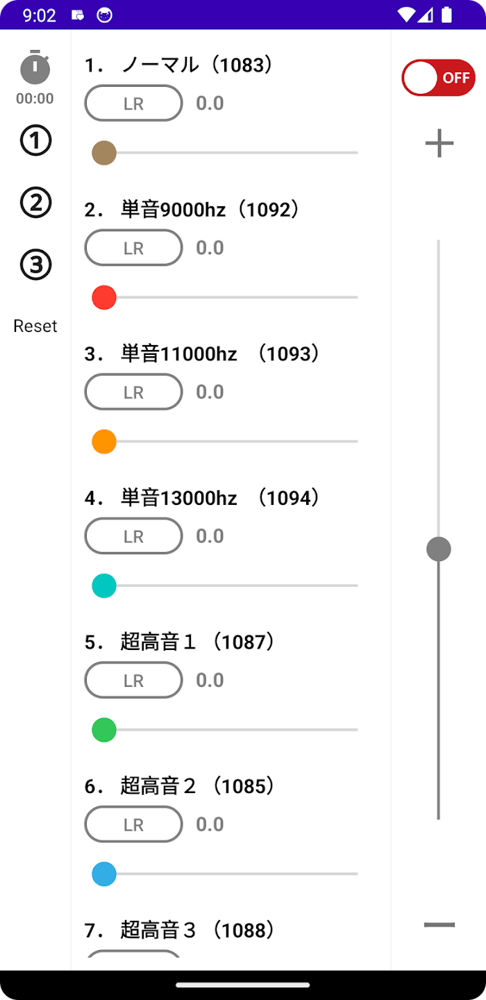
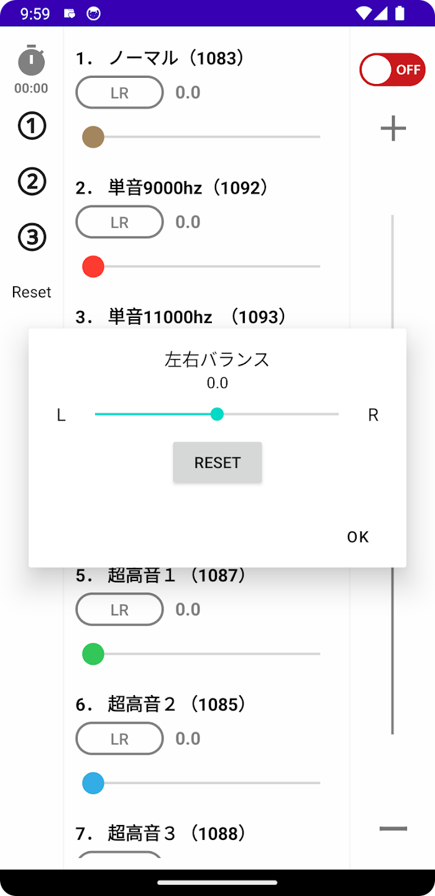

# 🎵 とろける〜耳鳴り！

<div align="center">
  
  
  [](https://play.google.com/store/apps/details?id=tinnitus.dissolves.app)
  [](https://developer.android.com/)
  [](https://kotlinlang.org/)
  
  **高音性耳鳴りに悩む方のための音響療法アプリ**
</div>

## 📖 概要

「とろける〜耳鳴り！」は、高音性の耳鳴りに長年悩まされた開発者が、同じ症状で苦しむ方々のために開発した音響療法アプリです。

耳鳴り軽減のために作成した音源を友人に試してもらったところ、非常に好評だったため、より多くの方にお役に立てるようアプリとして公開いたしました。

### ✨ 主な特徴

- 🎯 **30種類の専用音源**: 様々な周波数の単音・MIX音源を収録
- 🎚️ **細かな音量調整**: 個別の音量コントロールで最適な音量に設定
- ⚖️ **左右バランス調整**: 左右の聴力差に対応した音響バランス機能
- ⏰ **タイマー機能**: 就寝時などに便利な自動停止タイマー
- 🔄 **バックグラウンド再生**: アプリを閉じても音源の再生を継続
- 📱 **シンプルなUI**: 直感的で使いやすいインターフェース

## 📱 アプリ情報

- **アプリ名**: とろける〜耳鳴り！ (TOROKERU miminari)
- **パッケージ名**: `tinnitus.dissolves.app`
- **現在のバージョン**: 1.2.0 (ビルド 11)
- **対応OS**: Android 9.0 (API 28) 以上
- **カテゴリ**: 健康・フィットネス
- **開発者**: SAKAI SOKURYO JIMUSHO, K.K.

## 🎵 収録音源

アプリには以下のような音源が収録されています：

### 基本音源
- ノーマル音源 (1083Hz)
- 単音 MIX (1297Hz)
- 単音 (1295Hz)

### 高周波音源
- 超高音 MIX (1306Hz)
- 超高音 1-3 (1267Hz, 1087Hz, 1088Hz)
- 高音 MIX 単音プラス (1314Hz)

### 特殊音源
- 単音 9000Hz (1092Hz)
- 単音 11000Hz (1093Hz)
- 単音 13000Hz (1094Hz)

*その他、計30種類の音源を収録*

## 🛠️ 技術仕様

### 開発環境
- **言語**: Kotlin
- **フレームワーク**: Android Native + Jetpack Compose
- **最小SDK**: API 28 (Android 9.0)
- **ターゲットSDK**: API 35 (Android 14)
- **ビルドツール**: Gradle 8.x

### 主要な技術要素
- **音声再生**: ExoPlayer / MediaPlayer
- **バックグラウンド処理**: Foreground Service
- **UI**: Jetpack Compose + XML Layout
- **データ管理**: SharedPreferences
- **通知**: Android Notification API

### アーキテクチャ
```
app/
├── src/main/
│   ├── java/tinnitus/dissolves/tinnitus_dissolves/
│   │   ├── MainActivity.kt              # メインアクティビティ
│   │   ├── BackgroundService.kt         # バックグラウンド音声再生
│   │   ├── MyApplication.kt             # アプリケーションクラス
│   │   ├── components/                  # UIコンポーネント
│   │   │   ├── ListAdapter.kt
│   │   │   ├── HowToUseBottomSheet.kt
│   │   │   └── ...
│   │   ├── model/                       # データモデル
│   │   │   ├── MusicData.kt
│   │   │   └── SliderModel.kt
│   │   └── utils/                       # ユーティリティ
│   │       ├── ExoLoopPlayer.kt
│   │       ├── TimerManager.kt
│   │       └── ...
│   ├── res/
│   │   ├── raw/                         # 音源ファイル (s1.wav - s30.wav)
│   │   ├── layout/                      # レイアウトファイル
│   │   └── values/                      # リソース定義
│   └── AndroidManifest.xml
```

## 🚀 セットアップ・ビルド方法

### 前提条件
- Android Studio Arctic Fox 以上
- JDK 11 以上
- Android SDK (API 28-35)

### ビルド手順

1. **リポジトリのクローン**
```bash
git clone <repository-url>
cd tinnitus_dissolves
```

2. **Android Studioでプロジェクトを開く**
```bash
# Android Studioでプロジェクトフォルダを開く
```

3. **依存関係の同期**
```bash
./gradlew build
```

4. **デバッグビルドの実行**
```bash
./gradlew assembleDebug
```

5. **リリースビルド（署名付き）**
```bash
./gradlew assembleRelease
```

### 署名情報
- **キーストア**: `keystore2`
- **パスワード**: `torokeru`
- **エイリアス**: `torokeru`

## 📋 主要機能

### 🎵 音源再生機能
- 30種類の専用音源から選択可能
- ループ再生対応
- 個別音量調整
- 左右バランス調整

### ⏰ タイマー機能
- 自動停止タイマー設定
- バックグラウンド動作対応
- 通知による状態表示

### 🎛️ 音響調整
- 細かな音量コントロール
- 左右独立調整
- リアルタイム調整

### 📱 ユーザビリティ
- 直感的なUI/UX
- ワンタッチ操作
- 設定の自動保存

## 📸 スクリーンショット

<div align="center">
  
  
</div>

## 🔧 開発・貢献

### 開発ガイドライン
1. Kotlinのコーディング規約に従う
2. 新機能追加時は適切なテストを作成
3. UIの変更は複数デバイスでテスト
4. 音源追加時は適切な命名規則を使用

### 課題・改善点
- [ ] 音源の追加・カスタマイズ機能
- [ ] 使用統計・効果測定機能
- [ ] クラウド同期機能
- [ ] 多言語対応

### Google Play
[📱 Google Playでダウンロード](https://play.google.com/store/apps/details?id=tinnitus.dissolves.app)

## ⚠️ 免責事項

本アプリは耳鳴り症状の軽減を目的として開発されましたが、医療機器ではありません。症状が重い場合や改善が見られない場合は、必ず医療機関にご相談ください。

## 📄 ライセンス

このプロジェクトは個人利用・研究目的での使用を想定しています。商用利用については開発者にお問い合わせください。

---

<div align="center">
  <p><strong>同じ症状でお悩みの方のお役に立てれば幸いです</strong></p>
  <p>💙 開発者より愛を込めて 💙</p>
</div>